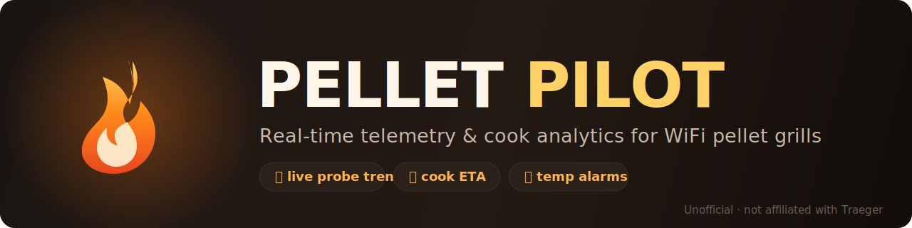
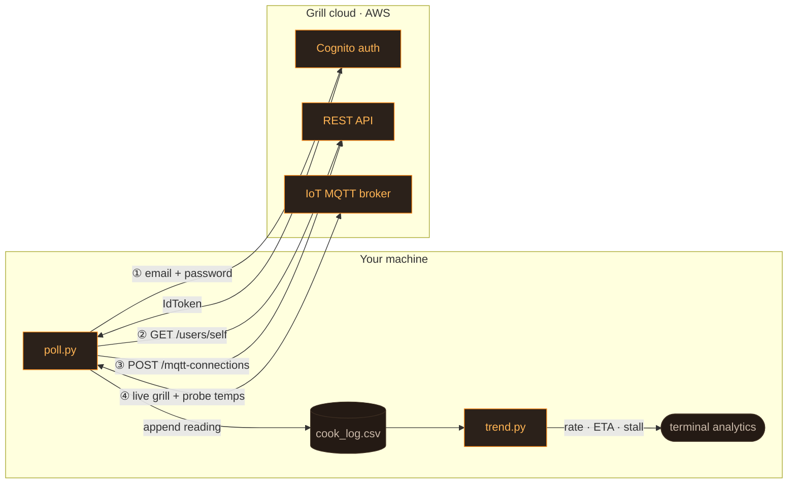

<p align="center">
  
</p>

<p align="center">
  <b>The pitmaster co-pilot for your WiFi pellet grill.</b><br>
  <sub>Live ETAs, stall detection, a coach that tells you when to wrap, and a report to show off the results — all from the terminal.</sub>
</p>

<p align="center">
  
  
  
  
  
</p>

> [!IMPORTANT]
> **Unofficial project.** Pellet Pilot is an independent, community-built tool. It is **not affiliated with, endorsed by, or sponsored by Traeger Inc.** "Traeger" and "WiFIRE" are trademarks of their respective owner and are used here only to describe compatibility. It talks to the same cloud the mobile app uses via a reverse-engineered protocol, which may break at any time and may be against the vendor's Terms of Service. Use at your own risk. It is also deliberately **read-only** — it never starts, stops, or changes your grill's temperature.

```bash
git clone https://github.com/ctopherwilliams/pellet-pilot.git && cd pellet-pilot
python3 -m venv venv && ./venv/bin/pip install -e .   # adds the `pellet` command
pellet watch --preset brisket --speak --coach          # after setting up credentials, below
```

---

## 🔥 Why Pellet Pilot

The mobile app shows you a number. Pellet Pilot gives you the **curve** — and does the math a pitmaster actually wants mid-cook:

- **📈 Live probe trend line** — rate of rise in °/min, with a sparkline of the climb.
- **⏱ Time-to-target ETA** — "your probe hits 203° at ~4:45 PM," updated every reading.
- **🧠 Stall detection** — flags the classic 150–170° brisket/pork-shoulder plateau so you don't panic (or wrap early).
- **🎙 A coach, not just a number** — rule-based advice on whether to hold for bark or wrap, and natural spoken updates that say what actually changed since last time.
- **🔔 Temperature alarms** — desktop notification + spoken alert when the probe crosses your thresholds, by name ("the pork butt," not "probe 1").
- **🗒 Your own cook history** — every reading logged to CSV, because the cloud keeps none. Query, re-plot, or export a shareable report of any past cook.
- **🖥 Terminal-native** — no app, no dashboard server. Pipe it, grep it, graph it.

### vs. the official app

|                              | Traeger app        | Pellet Pilot |
|------------------------------|:-------------------:|:------------:|
| Start / stop / set temp      | ✅                  | ❌ *(read-only, by design)* |
| Live grill & probe temps     | ✅                  | ✅ |
| Rate-of-rise + time-to-target ETA | ❌            | ✅ |
| Stall detection              | ❌                  | ✅ |
| Wrap/hold coaching           | ❌                  | ✅ rule-based |
| Natural spoken updates       | ❌                  | ✅ opt-in, name-your-probes |
| Cook history                 | ❌ *(not stored server-side)* | ✅ every reading, forever, locally |
| Shareable cook report        | ❌                  | ✅ self-contained HTML |
| Grafana / Prometheus export  | ❌                  | ✅ |
| Runs where                   | phone app           | terminal, any OS, or chat via Claude Code |
| Official support             | ✅                  | ❌ unofficial, community-built |

Pellet Pilot doesn't replace the app — it's for the parts the app was never built for: predicting, coaching, logging, and sharing. Keep the app for actually starting your cook.

---

## ⚡ Quickstart

```bash
git clone https://github.com/ctopherwilliams/pellet-pilot.git
cd pellet-pilot
python3 -m venv venv && ./venv/bin/pip install -r requirements.txt

cp .env.example .env          # add your grill account email
# store your password securely (choose one) — see "Credentials" below

./venv/bin/python poll.py                       # one live reading
./venv/bin/python poll.py --watch 30            # log every 30s during a cook
./venv/bin/python poll.py --watch 30 --alarm 203  # ...and ping me at 203°F
./venv/bin/python trend.py                      # rate + ETA to target
```

```text
[13:22:07] grill 277° (set 275°)  P1 168°→203°  [Running]
  ⏱  P1 ~47 min to 203° (≈ 4:45 PM) · +0.75°/min
```

### One command, with presets

`pellet` wraps the scripts above behind one entry point, and `--preset` fills in
`--stage`/`--probe-name` for a cut of meat so you don't retype them every cook:

```bash
./venv/bin/pip install -e .           # adds the `pellet` command (optional; scripts above still work standalone)
pellet presets                        # brisket, pork-butt, ribs, chicken
pellet watch --preset brisket --speak --chart
pellet history show
pellet trend
```

`pellet watch` is just `poll.py --watch 30` under the hood — every flag documented
above (`--alarm`, `--stage`, `--probe-name`, `--speak`, `--chart`, ...) still works;
`--preset` only pre-fills `--stage`/`--probe-name`, and an explicit flag you also
pass takes precedence. Add your own preset by dropping a YAML file in `presets/`
(see the shipped ones for the two-key `stage_specs`/`name_specs` shape).

---

## 💻 How to run it — Mac, Windows, or Claude Code

Two ways to use Pellet Pilot. Both work on **macOS, Windows, and Linux** — all you need is [Python 3.12+](https://www.python.org/downloads/).

### Option A — run it yourself (any computer)

**One-time setup** — paste into Terminal (Mac/Linux) or PowerShell (Windows):

<details open>
<summary><b>macOS / Linux</b></summary>

```bash
git clone https://github.com/ctopherwilliams/pellet-pilot.git
cd pellet-pilot
python3 -m venv venv
./venv/bin/pip install -r requirements.txt
cp .env.example .env          # then edit .env with your grill-app email + password
```

Run any tool with `./venv/bin/python <tool>.py`.
</details>

<details>
<summary><b>Windows (PowerShell)</b></summary>

```powershell
git clone https://github.com/ctopherwilliams/pellet-pilot.git
cd pellet-pilot
python -m venv venv
venv\Scripts\pip install -r requirements.txt
copy .env.example .env         # then edit .env with your grill-app email + password
```

Run any tool with `venv\Scripts\python <tool>.py`.
</details>

**Then, during a cook — it's just two windows:**

1. **Window 1 — start the loop and leave it running.** It checks the grill every 30 seconds, saves each reading to `cook_log.csv`, prints a live "when's it done" line, and beeps/notifies when you hit a stage:
   ```
   poll.py --watch 30 --stage 165:wrap --stage 205:done
   ```
   Every tick = one fresh reading logged + the prediction refreshed. Keep it open all cook; `Ctrl-C` to stop.

2. **Window 2 — ask "how's it going?" whenever you like:**
   ```
   trend.py               # current rate + ETA to the next gate
   history.py list        # your past cooks
   plot.py --out cook.svg # a chart of this cook
   ```

That's the whole idea: **one window logging + predicting, another for analysis.** (Prefix each command with `./venv/bin/python` on Mac/Linux, or `venv\Scripts\python` on Windows. Credential setup is in the **Credentials** section below.)

### Option B — run it inside Claude Code (chat with your cook) 🔥

If you have [Claude Code](https://claude.com/claude-code), this gets much nicer — you don't memorize any commands, you just **talk to it**. Open the `pellet-pilot` folder in Claude Code (`cd pellet-pilot && claude`) and say things like:

> - *"Start logging my cook — wrap at 165, done at 205."*
> - *"What's my trend? When will it be done?"*
> - *"Is it stalling? Should I wrap it?"*
> - *"Check on it every 20 minutes and tell me when it hits the wrap temp."*
> - *"Show me a chart of this cook."* · *"How did my last brisket turn out?"*

Claude Code runs the tools for you, reads the numbers, explains them in plain English, and can even **check back on a schedule and ping you** — the narrated version of "set it and forget it" below: ask it to watch the cook and it loops on its own, announcing ticks and pulling up a chart whenever you ask, without you touching a terminal again until it's done.

---

## 🎛 Set it and forget it

This is the point of the whole project: **one command, then walk away.**

```bash
./venv/bin/python poll.py --watch 30 --speak \
    --stage 165:wrap --stage 205:done \
    --chart cook.html
```

That single line gives you three things running continuously, unattended, for the whole cook:

- **Logs** every reading to `cook_log.csv` (`--watch 30`).
- **Speaks** a short update out loud every tick — temp, target, ETA — via `--speak`, not just when an alarm fires.
- **Keeps a chart current** at `cook.html` via `--chart` — open that file once in a browser and leave the tab open. It's a plain file, **no server, no port, nothing to secure** — it just quietly reloads itself every 30 seconds (a `<meta refresh>` tag) and always shows the latest pull/wrap markers and projected finish time.

Nothing here needs supervision: a chart-write hiccup or a momentary network blip never takes down the loop (best-effort, same philosophy as the alarms), and the ~1 hour auth token renews itself in the background — more on that in the prediction section just below. Add `--alarm`/`PUSHOVER_*`/`NTFY_TOPIC` if you also want a ping on your phone when a stage hits.

**In Claude Code, the same idea, narrated:** *"Start my cook — wrap at 165, done at 205, speak every tick, and keep a chart open."* Claude Code runs `--watch --speak --chart` for you, reads its own output, and checks back on a schedule with a plain-English tick instead of raw numbers — same "walk away" experience, spoken instead of read off a screen.

---

## 🔮 When will it be done?

This is the headline feature: Pellet Pilot watches the climb and tells you **when
each probe will hit its target** — live, as it polls.

```bash
./venv/bin/python poll.py --watch 30 --alarm 203
```

```text
[13:22:07] grill 277° (set 275°)  P1 168°→203°  [Running]
  ⏱  P1 ~47 min to 203° (≈ 4:45 PM) · +0.75°/min
```

Read that as: **probe 1 reaches 203° in about 47 minutes, ~4:45 PM, rising 0.75°/min.**
The estimate refreshes every reading and is fit from a **recent window** of data, so
it tracks the cook speeding up or slowing down instead of lagging on a whole-cook average.

**During the stall** — the 150–175° plateau where a big cut parks for a while — the
rate flattens, so instead of guessing a wild time it tells you plainly:

```text
  ⏱  P1 stalled near 152° · hold, or wrap to push through  (+0.03°/min)
```

Want a one-off check without the live loop? `trend.py` prints the same prediction
from your log at any time:

```bash
./venv/bin/python trend.py             # probe 1
./venv/bin/python trend.py --probe 2   # a second probe
./venv/bin/python trend.py --window 15 # base it on just the last 15 min
```

```text
=== probe1_temp trend ===
points:   34  over 61.0 min
current:  168°   (min 122°, max 168°)
trend:    ▁▁▂▂▃▃▄▄▅▅▆▆▇▇██
rate:     +0.75 °/min   (+45 °/hr, recent)
done:     ~47 min to 203° (≈ 4:45 PM) · +0.75°/min
```

> How it works: a least-squares fit over the recent window gives °/min, then
> `(target − current) ÷ rate` gives the minutes remaining. Below ~0.05°/min it
> reports *stalled* (in the plateau band) or *not rising* rather than a bogus ETA.

**See it as a chart:** `plot.py --probe 1` renders the whole cook as an SVG — it
auto-detects the pull/wrap (from the probe-out temperature spike), draws your stage
lines, and adds a **dashed projection to the finish time**. `--html` makes it
interactive (hover any point). This is the graph version of the prediction above.

### Multi-stage cooks (wrap, then done)

Big cuts have milestones, not one target: pull-to-**wrap** at 165°, then pull-to-rest
(**done**) at 203°. Define the **stages** and Pellet Pilot predicts the *next* one and
estimates the final, advancing as each is crossed:

```bash
./venv/bin/python poll.py --watch 30 --stage 165:wrap --stage 203:done
```

```text
[13:22:07] grill 277°  P1 158° → wrap 165° → done 203°  [Running]
  ⏱  P1 next: WRAP at 165° in ~9 min (≈ 1:31 PM)  ·  then done 203° ~2h 10m (est)
```

When it crosses a stage you get a labeled alarm — **"P1 165° — WRAP IT"** — then the
prediction rolls to the next stage. Stage syntax is `[PROBE:]TEMP[:LABEL]` (e.g.
`--stage 2:170:wrap`); up to 4 stages per probe. Set them once and `trend.py` /
`history.py` reuse the plan automatically (saved to a gitignored `.cook_plan.json`;
`--no-plan` to skip). `history.py show` reports when each stage was reached.

### Name your probes

Nobody thinks in probe numbers — you know it's the pork butt, not "probe 1". Give
each probe a name and both `--speak` announcements and alarm messages use it:

```bash
./venv/bin/python poll.py --watch 30 --speak --probe-name "pork butt" --stage 165:wrap --stage 203:done
```

```text
🔊 Update 4. the pork butt is at 160 degrees, heading to wrap at 165 -- ...
```

Syntax is `[PROBE:]NAME` (bare name → probe 1, e.g. `--probe-name 2:brisket` for
probe 2). Set once and it's remembered across `--watch` runs (saved to a gitignored
`.probe_names.json`).

### Wrap Coach — should you wrap now?

Rule-based, mid-cook advice on whether to hold for more bark or wrap to push through —
no ML, no network, just the same recent-window forecast and stall band already driving
the ETA:

```bash
./venv/bin/python poll.py --watch 30 --coach --stage 165:wrap --stage 203:done
```

```text
  🟡 the pork butt: 47 minutes into the stall -- normal, bark's still setting. Hold for more bark, or wrap now to push through faster.
```

It escalates ("🔴 urgent") past ~90 minutes in a single continuous stall, and knows
the difference between "still stalled, not wrapped yet" and "wrapped and *still*
stalled" (the latter suggests bumping the grill temp instead of wrapping again).

---

## 🔐 Credentials

Your password is **never** committed, hard-coded, or written to a plaintext log. Pick whichever fits your setup — the program tries them in order and uses the first that works.

### Basic setup — any OS (Linux · Windows · macOS)

The simplest option: drop your login into a local `.env` file (already gitignored).

```bash
cp .env.example .env
```

Then edit `.env`:

```ini
TRAEGER_USERNAME=you@example.com
TRAEGER_PASSWORD=your-grill-account-password
```

That's all — run `poll.py`. This is the same email &amp; password you use in the grill's mobile app.

<details>
<summary>Prefer an environment variable over a file?</summary>

**Linux / macOS (bash · zsh):**
```bash
export TRAEGER_USERNAME="you@example.com"
export TRAEGER_PASSWORD="your-password"
```

**Windows (PowerShell):**
```powershell
$env:TRAEGER_USERNAME = "you@example.com"
$env:TRAEGER_PASSWORD = "your-password"
```
</details>

### Advanced — keep the password out of any file

| Source | How | Notes |
|--------|-----|-------|
| 🔑 **Bitwarden** (any OS) | Unlock your vault into a session, set `TRAEGER_BW_ITEM` to the item name/id | Fetched in-memory at runtime |
| 🍎 **macOS Keychain** | `security add-generic-password -s traeger-wifire -a you@email -w` | Encrypted at rest |

See [SECURITY.md](SECURITY.md) for the full model and what is *never* written to disk.

---

## 🧩 How it works



- **`traeger_client.py`** — auth, grill discovery, one-shot MQTT status read, status parser.
- **`poll.py`** — poll & log; `--watch` loop with auto re-auth for long cooks; probe alarms.
- **`trend.py`** — linear trend, rise rate, time-to-target, stall detector.

### Controller status codes

The `[state]` shown in `poll.py` output comes straight from the grill. Here's what each code means, from "off" to "actively cooking":

| Code | Status | What's happening |
|---|---|---|
| 2 | Sleeping | Powered on, screen off |
| 3 | Idle | Powered on, screen on, not cooking |
| 4 | Igniting | Startup — lighting the fire pot |
| 5 | Preheating | Warming up to the set temperature |
| 6 | Manual cook | Actively cooking, manual mode |
| 7 | Custom cook | Actively cooking, a saved custom program |
| 8 | Cool-down | Finishing up, fan running to cool down |
| 9 | Shutting down | Cool-down complete, powering off |
| 99 | Running¹ | Actively cooking (newer Timberline-class controllers) |

<sub>¹ On older D2 controllers, code 99 meant "offline" instead. Pellet Pilot trusts live connection + temps over the raw code, so it won't mislabel an active cook as offline.</sub>

---

## 📥 Note on historical data

The grill cloud does **not** expose past temperatures — the in-app graph is drawn live and never stored server-side. That's why Pellet Pilot logs everything itself: **`cook_log.csv` is your history.** Start `--watch` at the beginning of a cook and you'll have the complete curve to analyze afterward.

---

## 🧰 More tools

```bash
# Multiple probes: alarms and trends target a specific probe
./venv/bin/python poll.py --watch 30 --alarm 1:203 --alarm 2:165
./venv/bin/python trend.py --probe 2

# Browse past cooks (sessions split on gaps in the log)
./venv/bin/python history.py list
./venv/bin/python history.py show 1
./venv/bin/python history.py summary

# Chart a cook — SVG (no deps), interactive HTML, or PNG (matplotlib)
./venv/bin/python plot.py --out cook.svg
./venv/bin/python plot.py --probe 1 --out meat.svg # meat-probe forecast chart (below)
./venv/bin/python plot.py --html --out cook.html
./venv/bin/python plot.py --png --out cook.png     # pip install -r requirements-plot.txt

# --chart keeps that same chart current automatically during --watch, no re-run needed
./venv/bin/python poll.py --watch 30 --chart cook.html   # see "Set it and forget it" above

# Grafana-friendly export (local files) or a localhost Prometheus endpoint
./venv/bin/python export.py --format influx --out cook.lp
./venv/bin/python export.py --serve                # http://127.0.0.1:9109/metrics

# Shareable Cook Report — one self-contained HTML file (chart + stats), no server
./venv/bin/python report.py --out cook_report.html
```

The Cook Report embeds its chart inline and never includes the grill's device
identifier, so it's safe to send to someone or post — unlike the raw `cook_log.csv`.


**Remote alarms** (in addition to the local macOS notification) — set any of these
env vars and probe-crossing alerts are delivered there too:

| Provider | Env |
|---|---|
| Pushover | `PUSHOVER_TOKEN`, `PUSHOVER_USER` |
| ntfy | `NTFY_TOPIC` (server via `NTFY_SERVER`) |
| Webhook | `ALARM_WEBHOOK_URL` (POSTed JSON) |

HTTPS is required and the generic webhook is SSRF-guarded (private/loopback/metadata
addresses are refused). See [SECURITY.md](SECURITY.md).

**Issue autopilot** — apply the `autofix` label to an issue for an AI-drafted fix
plan, then `autofix-approved` to get a human-reviewed PR. Label-gated, never
auto-merged; requires an `ANTHROPIC_API_KEY` repo secret. See [SECURITY.md](SECURITY.md).

---

## 🗺 Roadmap

Pellet Pilot already covers the full loop end to end: multi-probe live tracking,
stage-aware predictions with spoken updates and rule-based wrap coaching, named
probes, local + remote alarms, cook history, charts with projected finish
times, a shareable Cook Report, a unified CLI with presets, and Grafana
export. Here's where it can go next:

- [ ] **`history.py compare A B`** — overlay two past cooks on one chart ("is this brisket tracking like my last one?")
- [ ] **Publish to PyPI** — `pellet` already works via `pip install -e .`; a real release would drop the "clone + venv" step for non-developers
- [ ] **Interactive Cognito MFA/challenge support at login** — refresh-token renewal is handled, but accounts with MFA enabled still can't complete the *initial* login
- [ ] **Per-grill filtering** (`--grill <thingName>`) in `trend`/`history`/`plot`/`export` — logging already tags every row by grill, but the analysis tools don't yet let you select one when an account has more than one Traeger
- [ ] **Voice-update pacing** — `--speak` announces every tick by design; a future option to summarize every Nth tick or add quiet hours
- [ ] **Wrap Coach using grill temp too** — advice is currently probe-only; factoring in grill temp/lid-open drops could catch more (e.g. a temp swing from a lid check, not a real stall break)

Have an idea? Open an issue — with the `autofix` label, this repo can draft its own fix.

---

## 🙌 Credits

Built on protocol research from the Home Assistant Traeger integration community
([sebirdman](https://github.com/sebirdman/hass_traeger), [lymanepp](https://github.com/lymanepp/ha-traeger), [johnvoipguy](https://github.com/johnvoipguy/Traeger-WiFire)). Huge thanks to those maintainers.

## 📄 License

[MIT](LICENSE) © 2026 ctopherwilliams. Not affiliated with Traeger Inc.
